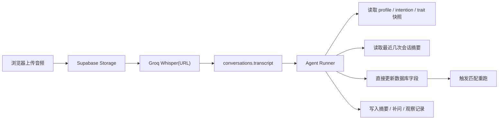

# Matchmaking Studio - Agent 化提取 POC 方案

> 日期：2026-04-03  
> 分支：`codex/agent-extract-poc`  
> 目标：验证“用本地/云端 Agent 分步骤处理 transcript 并直接更新数据库”是否比当前“一次性返回大 JSON 合同”更稳、更快、更适合核心工作流。

---

## 一、为什么要尝试这个方案

当前产品最核心的工作流只有一条：

```text
上传音频 -> 转成文字 -> 提取字段 -> 写数据库
```

这条链路已经跑通，但还没有达到“产品级稳定”。真实体验里，最容易出问题的不是 Whisper，而是转录完成后的结构化提取和落库阶段。

之所以要尝试 Agent 化方案，不是因为现有模型不够强，而是因为当前实现把太多职责压到了“一次返回一个大 JSON”上：

- Claude 既要理解 transcript
- 又要处理当前客户快照
- 又要遵守字段说明书
- 又要判断冲突、补问、摘要、处理备注
- 最后还要一次性返回一个格式完全正确的大 JSON

这会让核心工作流变成：

- 返回体太长
- JSON 太脆
- 任一字段坏掉就整包失败
- 调试困难
- 错误恢复困难

Agent 化方案的价值在于：

1. 可以把工作拆成多步，而不是一次吐完整结果  
2. 可以边判断边写库，而不是先生成一个脆弱的大 JSON  
3. 出错点更容易定位  
4. 更适合逐步积累经验、few-shot、术语词典和历史上下文  
5. 更接近未来“云端 AI 助理”的真实运行方式

一句话：

**我们不是要换模型，而是要换执行结构。**

---

## 二、当前方案的核心痛点

### 2.1 一次性大 JSON 返回太脆

当前 `/api/extract` 的本质是：

```text
transcript + 当前客户快照 + 字段说明书 + 转录元信息
-> Claude
-> 返回 JSON
-> 服务端解析
-> 写数据库
```

真实问题已经出现过：

- JSON 被截断
- JSON 外面包了说明文字
- 字符串里的引号没转义
- 某个字段结构漂移导致整包失败

也就是说，**不是字段判断一定错，而是传输合同太脆。**

### 2.2 提取职责过重

当前结构里，模型被要求同时返回：

- `field_updates`
- `review_required`
- `missing_critical_fields`
- `suggested_followup_questions`
- `summary_updates`
- `processing_notes`

这对 V1 核心工作流来说太重了。真正最重要的，其实只是：

- 先把字段写进数据库

而不是：

- 每个字段都带解释
- 每次都要完整补问清单
- 每次都生成一大段处理备注

### 2.3 提取与写库耦合过死

现在的设计是：

- 先得到一个完整结构化结果
- 然后再统一应用

只要上游结构化输出坏掉，写库就完全停住。  
这让“能不能写库”过度依赖“JSON 是否完美”。

### 2.4 不利于经验积累

当前方案虽然有 prompt 和字段说明书，但它仍然更像一次性调用：

- 没有真正的多步推理
- 没有真正的工具调用
- 没有真正的中间状态
- 没有把经验积累成显式的处理流程

这意味着后续要优化：

- 模糊事实判断
- 敏感字段判断
- 历史谈话整合
- 补问策略

都会越来越困难。

---

## 三、POC 方案的目标

这次 POC 不追求一下子替换全系统，而是只验证一件事：

**Agent 是否能在读取 transcript 后，用多步方式稳定完成字段更新。**

POC 只需要回答下面这几个问题：

1. Agent 能否读取 transcript、客户快照和历史摘要后，稳定完成字段提取  
2. Agent 能否不依赖“一次性大 JSON 合同”，而是分步骤更新数据库  
3. Agent 风格流程的成功率，是否高于当前 `/api/extract`  
4. 如果本地跑通，是否容易迁移到云服务器 / OpenClaw 环境

---

## 四、POC 的总体设计

### 4.1 核心思路

POC 不再把 Claude 当成“JSON 生成器”，而是把 Agent 当成“可执行的结构化处理器”。

目标流程改成：

```text
浏览器上传音频 -> 对象存储
-> Groq 用 URL 转录
-> transcript 写回 conversations
-> Agent 读取 transcript
-> Agent 读取当前 profile/intention/trait 快照
-> Agent 分步骤判断
-> Agent 直接更新数据库
-> Agent 生成摘要/补问/后续动作
```

### 4.2 先不改动的部分

本次 POC 不需要动这些：

- 前端上传交互
- Supabase Storage
- Groq Whisper URL 转录
- conversations 原始录音记录

也就是说：

**POC 只替换“转录之后如何提取并写库”这一段。**

### 4.3 POC 阶段不刻意限制 Agent 能力

这是本次实验的关键前提。

在生产系统里，我会建议 Agent 通过受限工具写库；但在 POC 阶段，优先级不是安全边界，而是：

- 先验证可行性
- 先看成功率
- 先看是否比大 JSON 更稳

因此 POC 阶段的原则是：

- **不刻意阉割 Agent**
- 允许 Agent 拥有更强的上下文读取能力
- 允许 Agent 直接编辑数据库内容
- 允许 Agent 在必要时多步迭代修正

但仍建议保留两件事：

1. 明确日志  
2. 明确 dry-run / real-run 开关

这样即便能力放宽，仍然可回放、可对比、可调试。

### 4.4 本地优先，云端复用

之所以先在本地做，是因为：

- 本地更容易观察 agent 行为
- 更容易回放 transcript
- 更容易快速改 prompt/策略
- 跑通后迁移到云服务器时，逻辑几乎可以原样复用

所以推荐路径是：

```text
本地 Codex / Agent Runner 跑通
-> 分支内完成 3-5 条 transcript 回放
-> 对比当前 JSON 流程
-> 再迁到云服务器 / OpenClaw
```

---

## 五、建议的 POC 架构

### 5.1 数据流



### 5.2 Agent 的输入

POC 阶段，Agent 的输入建议只有这些：

- transcript
- 当前客户快照
- 最近几次会话摘要
- 字段说明书
- 本次 conversation 元信息

不再强迫它一次性输出完整合同。

### 5.3 Agent 的输出

POC 阶段推荐两种输出形态：

#### 形态 A：直接写库

Agent 自己完成：

- 更新 `profiles`
- 更新 `intentions`
- 更新 `trait_profiles`
- 更新 `conversations.ai_summary`
- 更新 `followup_tasks`

#### 形态 B：执行摘要

Agent 额外输出一份简短执行摘要，例如：

```txt
已更新年龄、城市、学历、收入、婚恋意图。
新增一条补问：是否接受对方有孩子。
未更新婚史，因为 transcript 中未明确提到。
```

这份摘要不是合同，而是 debug / 审阅辅助。

---

## 六、为什么这条路可能比当前 JSON 合同更优

### 6.1 不再依赖一次性大 JSON 成功

只要 Agent 能分步骤做事，就不需要把所有结果挤进一个容易损坏的 JSON 里。

### 6.2 更适合“先事实、后判断、再摘要”

Agent 可以天然拆步骤：

1. 先写明确事实字段  
2. 再写可推断字段  
3. 再补摘要和跟进建议

这比当前一锅炖更合理。

### 6.3 更适合未来沉淀经验

后续要加：

- 术语词典
- 城市/学历/收入归一化
- 敏感字段判断策略
- 历史谈话融合
- few-shot transcript 示例

这些都更适合 Agent 流程，而不是塞进一个越来越重的 prompt 合同里。

### 6.4 更适合云端 Worker 化

如果本地 POC 成功，部署到云端本质上就是：

- 把 Agent Runner 放到云服务器 / OpenClaw
- 把 transcript 任务改成后台 worker 触发

这比重写一套新架构简单得多。

---

## 七、POC 阶段的范围控制

为了避免实验失焦，POC 阶段只做这些：

### 必做

- transcript -> Agent -> 数据库字段更新
- 写入 `profiles / intentions / trait_profiles`
- 生成一份简短执行摘要
- 能对同一 transcript 重放测试

### 可选

- 写入补问任务
- 写入 `field_observations`
- 触发匹配重跑

### 暂不做

- 长音频自动分段
- 多 Agent 协同
- 复杂权限治理
- 彻底替换现有 `/api/extract`

一句话：

**POC 先验证“能不能稳地写库”，不要一上来挑战全量替换。**

---

## 八、建议的本地实现形态

建议在分支 `codex/agent-extract-poc` 里新增一个独立实验目录：

```text
experiments/agent-worker/
  README.md
  run-agent-extraction.ts
  agent-context.ts
  agent-prompt.ts
  agent-db.ts
  fixtures/
```

### 为什么独立目录更好

- 不污染当前生产路径
- 可快速回放 transcript
- 可对比当前 `/api/extract`
- 失败了可以直接丢，不影响主线

---

## 九、可用 skill 盘点

这次我检查了当前环境里和这个方案最相关的 skill。

### 9.1 最相关的 skill

#### `vercel:ai-sdk`

最适合负责：

- Agent 结构
- tool calling
- 模型调用抽象
- structured output 的兜底
- MCP / agent loop 设计

它是当前最接近“如何搭一个 Agent 提取器”的现成 skill。

#### `vercel:workflow`

最适合负责：

- 把 Agent 化提取做成后台 durable workflow
- 多步骤执行
- retry / pause / resume
- 长任务 crash-safe

如果后面要从本地 POC 迁到云端 worker，这个 skill 很关键。

#### `supabase-postgres-best-practices`

最适合负责：

- 数据库 schema 和索引设计
- RLS / 权限边界
- 查询与写入性能
- agent 写库后的表结构优化

它不是“Agent skill”，但对“让 Agent 改数据库”非常重要。

### 9.2 辅助 skill

#### `ljg-skill-map`

适合在需要全面盘点本地 skill 能力时快速扫描技能图谱。

### 9.3 当前没有的专用 skill

目前环境里**没有一个现成的、专门叫做“结构化提取 skill”或“数据库编辑 skill”的独立 skill**。  
更现实的做法是组合：

- `vercel:ai-sdk`
- `vercel:workflow`
- `supabase-postgres-best-practices`

来完成这次 Agent POC。

---

## 十、与当前正式方案的关系

这次 POC 不等于立即推翻现有主流程。

更合理的关系是：

- 当前主线继续保持可用
- 实验分支验证 Agent 路线
- 如果 Agent 路线明显更稳，再逐步替换 `/api/extract`

所以它是：

**一条实验线，不是立刻切生产。**

---

## 十一、当前建议的下一步

1. 在 `codex/agent-extract-poc` 分支中建立 `experiments/agent-worker/`
2. 先做一个本地 transcript 回放 runner
3. 选 3-5 条真实 transcript 做对比实验
4. 对比两种方案：
   - 成功率
   - 落库准确率
   - 失败恢复能力
   - prompt/上下文复杂度
5. 如果本地稳定，再迁到云服务器 / OpenClaw

---

## 十二、POC 阶段需要你后续拍板的点

当前已经确认：

- 要尝试 Agent 化结构
- POC 阶段不要过度限制 Agent 能力
- 先在本地跑通，再考虑云端部署

后续仍需要明确：

1. POC 是否直接操作当前 Supabase 项目，还是单独用测试项目  
2. Agent 的运行入口是：
   - 本地 Codex runner
   - 还是你计划部署的 OpenClaw worker
3. POC 完成后，是要：
   - 只做对比实验
   - 还是逐步替换现有 `/api/extract`

---

## 十三、最终判断

当前这条 Agent 方案值得试，不是因为它更“炫”，而是因为它更贴合这个产品的真实需要：

- 这个产品真正要的是稳定写库
- 不是一次性返回一个完美 JSON
- 也不是让模型解释一大堆理由

所以这次 POC 的目标非常明确：

**验证 Agent 是否能比当前 JSON 合同方案更稳地完成 transcript -> database 的核心闭环。**
