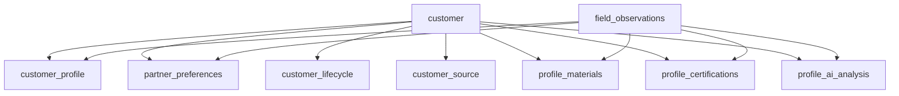

# 甄恋 CRM 主数据模型冻结 v1

> 状态：`v1` 冻结，可引用  
> 适用范围：甄恋 CRM 当前主线第一阶段，主数据模型冻结  
> 上游文档：
> - [plan-zhenlian-phase-1.md](/Users/myandong/Projects/marry2/docs/current/zhenlian/plan-zhenlian-phase-1.md)
> - [freeze-zhenlian-fields-v1.md](/Users/myandong/Projects/marry2/docs/current/zhenlian/freeze-zhenlian-fields-v1.md)
> - [todo-zhenlian-phase-1.md](/Users/myandong/Projects/marry2/docs/current/zhenlian/todo-zhenlian-phase-1.md)
> 说明：本文回答“字段应该挂在哪个对象上、对象之间怎么关系、三种入口怎么写入同一客户、确认值/草稿值/派生值如何共存”，是第一阶段正式对象合同。

---

## 一、冻结结论

第一阶段主数据模型 `v1` 固定为 7 个正式业务对象：

1. `customer_profile`
2. `partner_preferences`
3. `customer_lifecycle`
4. `customer_source`
5. `profile_materials`
6. `profile_certifications`
7. `profile_ai_analysis`

同时固定 1 个跨对象证据层：

- `field_observations`

这里的关键决策是：

- `customer_profile` 只承载“客户本人事实”
- `partner_preferences` 只承载“客户想找什么人”
- `customer_lifecycle` 只承载“当前推进到哪、下一步怎么走”
- `customer_source / profile_materials / profile_certifications / profile_ai_analysis` 都是独立对象，不再继续塞进基础档案备注
- `field_observations` 只做证据与候选值承接，不直接替代正式对象

---

## 二、模型原则

### 2.1 先冻结逻辑对象，再决定物理落库方式

这一轮冻结的是逻辑对象边界，不强制要求每个对象都立刻变成一张独立数据库表。

允许的实现方式：

- 先以现有 `profiles / intentions` 为物理承载
- 先用对象分组或 JSON 子结构承接某些低频对象
- 后续再按访问频率和审核流拆独立表

不允许的实现方式：

- 因为当前代码里还没拆表，就把对象边界继续写糊
- 因为页面方便，就把 `status`、来源、认证、AI 摘要重新塞回主档案

### 2.2 “客户聚合对象”与“业务子对象”分离

第一阶段默认存在一个上层聚合视图：

```ts
customer = {
  profile,
  preferences,
  lifecycle,
  source,
  materials,
  certifications,
  ai_analysis,
}
```

但这只是读取聚合，不代表这些内容属于同一业务对象。

### 2.3 证据层不直接等于正式值

`field_observations` 是候选值和证据层，不是客户正式档案层。

也就是说：

- `field_observations` 可以记录“AI 从录音里提到了什么”
- 正式对象记录“当前业务上确认采用什么值”
- 同一个字段可以先有 observation，再被提升为正式值

---

## 三、正式对象清单

### 3.1 `customer_profile`

**定位**

客户本人是谁、具备什么长期相对稳定的事实、是否能进入高频筛选。

**正式包含**

- `full_name`
- `display_name`
- `gender`
- `current_city`
- `birth_year_month`
- `age`
- `height_cm`
- `weight_kg`
- `phone`
- `wechat_id`
- `hukou_city`
- `native_place`
- `zodiac_sign`
- `education_level`
- `bachelor_school`
- `master_school`
- `doctor_school`
- `major`
- `company_name`
- `job_title`
- `monthly_income`
- `annual_income`
- `income_source_type`
- `appearance_score`
- `marital_history`
- `marital_history_notes`
- `has_children`
- `children_count`
- `children_age_notes`
- `custody_status`
- `financial_ties_with_ex_partner`
- `smokes`
- `smoking_frequency`
- `drinks`
- `drinking_frequency`
- `has_property`
- `property_count`
- `property_notes`
- `has_vehicle`
- `vehicle_brand`
- `vehicle_model`
- `vehicle_notes`
- `family_asset_band`
- `financial_assets_notes`
- `insurance_notes`
- `urgency_level`
- `siblings_summary`
- `parents_occupation`
- `parents_marital_status`
- `family_origin_notes`
- `personality_summary`
- `mbti`
- `hobbies`
- `self_description`

**明确不包含**

- `status`
- `owner`
- `next_action`
- `due_at`
- `blocking_reason`
- 来源字段
- 头像 / 生活照 / 材料文件
- 认证状态与认证材料
- AI 摘要和待确认标记
- 择偶要求字段

**对象判断标准**

- 如果它描述的是“客户自己是什么样的人”，优先放这里
- 如果它描述的是“客户现在推进到哪”，不放这里
- 如果它描述的是“客户想找什么人”，不放这里

### 3.2 `partner_preferences`

**定位**

客户对目标对象的硬条件、软偏好、婚育边界与情感表达。

**正式包含**

- `primary_intent`
- `preferred_age_min`
- `preferred_age_max`
- `preferred_height_min`
- `preferred_height_max`
- `preferred_locations`
- `preferred_education_levels`
- `preferred_occupation_notes`
- `preferred_financial_requirements`
- `accepts_partner_marital_history`
- `accepts_partner_children`
- `preferred_personality_notes`
- `message_to_future_partner`
- `accepts_long_distance`
- `preferred_date_frequency_notes`
- `monthly_dating_budget`
- `gift_preference_notes`
- `accepts_relocation`
- `wedding_scale_preference`
- `post_marriage_property_arrangement_notes`
- `accepts_living_with_partner_parents`
- `preferred_children_count`
- `childbearing_timeline_notes`
- `parenting_role_preference_notes`
- `requires_fertility_proof`

**明确不包含**

- 客户本人事实字段
- 生命周期字段
- 来源 / 材料 / 认证 / AI 摘要

**对象判断标准**

- 如果它描述的是“客户对另一半或关系的要求”，放这里
- 即使它和客户本人事实相关联，也不回写到 `customer_profile`

### 3.3 `customer_lifecycle`

**定位**

客户当前推进状态、责任归属、下一步动作和推进阻塞。

**正式包含**

- `status`
- `owner`
- `next_action`
- `due_at`
- `blocking_reason`
- `last_progressed_at`
- `last_contact_at`
- `paused_at`
- `archived_at`

**明确不包含**

- 状态变更日志明细
- 匹配候选结果
- 客户静态档案字段

**冻结边界**

- `status` 虽然属于 `P0` 主显，但对象归属只在这里
- `owner / next_action / due_at / blocking_reason` 只在这里，不再散在备注
- 完整状态集合和迁移矩阵，已由 [freeze-zhenlian-status-model-v1.md](/Users/myandong/Projects/marry2/docs/current/zhenlian/freeze-zhenlian-status-model-v1.md) 收口

### 3.4 `customer_source`

**定位**

客户从哪里来、以什么渠道进入、何时获客、是否需要保留来源备注。

**正式包含**

- `primary_source_channel`
- `source_code`
- `acquired_at`
- `source_notes`
- `referrer_name`
- `campaign_name`

**明确不包含**

- 渠道 ROI 计算逻辑
- 分销 / 多门店结算
- 生命周期推进信息

**冻结边界**

- 第一阶段只冻结“来源事实”，不展开渠道经营模型

### 3.5 `profile_materials`

**定位**

客户资料文件与图片材料，不再继续混成一个模糊图片字段。

**正式包含**

- `avatar_url`
- `lifestyle_photo_urls`
- `supplemental_materials`

建议 `supplemental_materials` 的子结构固定为：

```ts
{
  kind: 'document' | 'screenshot' | 'voice_note' | 'other'
  url: string
  title: string | null
  description: string | null
  uploaded_at: string | null
  source: 'matchmaker' | 'client' | 'imported' | 'system'
}
```

**明确不包含**

- 认证状态本身
- 资料卡排版结果
- AI 摘要文本

**冻结边界**

- 头像和生活照是不同语义
- 材料是文件层，不直接等于认证结论

### 3.6 `profile_certifications`

**定位**

认证类型、认证状态、认证材料引用与审核备注。

**正式包含**

- `certification_items`

建议 `certification_items` 子结构固定为：

```ts
{
  type: 'identity' | 'education' | 'income' | 'assets' | 'marital_history' | 'health' | 'other'
  status: 'not_submitted' | 'pending_review' | 'verified' | 'rejected'
  material_refs: string[]
  reviewed_at: string | null
  reviewed_by: string | null
  review_notes: string | null
}
```

**明确不包含**

- 认证等级策略
- 优先匹配权重
- 审核流程页面细节

**冻结边界**

- 第一阶段只冻结对象边界和最小结构
- 完整认证体系仍属于后续专项

### 3.7 `profile_ai_analysis`

**定位**

AI 对客户的摘要、隐性诉求整理和待确认字段列表。

**正式包含**

- `ai_summary`
- `hidden_expectations`
- `pending_confirmation_fields`
- `analysis_updated_at`
- `analysis_source`

建议 `pending_confirmation_fields` 固定为：

```ts
Array<{
  field_key: string
  reason: string
  importance: 'high' | 'medium' | 'low'
}>
```

**明确不包含**

- 模型中间推理
- 原始 transcript
- 状态提醒对象

**冻结边界**

- AI 摘要只能作为辅助判断
- 不能冒充人工确认事实

---

## 四、跨对象证据层

### 4.1 `field_observations`

`field_observations` 不是正式业务对象，但在主数据模型里必须被视为正式支撑层。

**定位**

- 记录字段候选值
- 记录证据文本
- 记录来源类型
- 记录验证状态

**当前已存在的关键字段**

- `profile_id`
- `conversation_id`
- `field_key`
- `field_value_json`
- `source_type`
- `confidence`
- `verification_status`
- `evidence_text`

**固定角色**

- 它承接 `AI 提取值 / 原始资料值 / 红娘摘要值`
- 它为“草稿值”和“待确认值”提供证据链
- 它不直接替代 `customer_profile` 或 `partner_preferences` 的正式值

### 4.2 值状态模型

第一阶段统一把字段值分成 3 种状态：

| 状态 | 说明 | 正式落点 |
|------|------|------|
| `confirmed` | 当前业务上采用的正式值 | 各正式对象 |
| `draft` | 候选值、待确认值、冲突值 | `field_observations` + `profile_ai_analysis.pending_confirmation_fields` |
| `derived` | 根据正式值换算或派生的值 | 各对象中的派生字段 |

固定规则：

- `confirmed` 才能进入正式业务筛选和主显
- `draft` 可以提示补问，但不应偷偷覆盖 `confirmed`
- `derived` 只能依附源字段，不反向写坏源字段

---

## 五、对象关系图



---

## 六、主对象与子对象落位规则

### 6.1 高查询频率字段

这些字段应优先保持可直接筛选和主显：

- `customer_profile` 里的 `P0/P1/P2` 高频标量字段
- `partner_preferences` 里的 `primary_intent`、年龄/身高/地域/学历偏好
- `customer_lifecycle` 里的 `status / owner / next_action / due_at`
- `customer_source` 里的主渠道与获客时间

### 6.2 子对象 / 子表优先承接的内容

这些内容不应继续强塞进主档案宽表：

- `profile_materials`
- `profile_certifications`
- `profile_ai_analysis`
- `field_observations`
- 后续的状态日志

### 6.3 当前实现映射建议

| 逻辑对象 | 第一阶段物理承接建议 | 备注 |
|------|------|------|
| `customer_profile` | 以 `profiles` 为主承接 | 当前已存在最接近的物理表 |
| `partner_preferences` | 以 `intentions` 为主承接 | 当前已存在最接近的物理表 |
| `customer_lifecycle` | 先允许部分字段存在 `profiles` 承接，但 API/文档按独立对象输出 | 后续可独立拆表 |
| `customer_source` | 允许先以 `profiles` 子字段或独立子对象承接 | 重点是对象边界先定死 |
| `profile_materials` | 允许先由 `profiles` + 文件引用承接，但逻辑上独立 | 头像/生活照不可混语义 |
| `profile_certifications` | 优先设计为独立对象 / 子表 | 审核流天然更适合单独维护 |
| `profile_ai_analysis` | 可先以独立对象或 `profiles` 扩展字段承接 | 但逻辑上必须独立于客户本人事实 |

---

## 七、三入口写入与合并规则

### 7.1 手动建档

默认规则：

- 红娘手动填写的明确事实，直接进入正式对象，状态视为 `confirmed`
- 如果红娘明确标记“待确认”，则进入 `field_observations` 或 `pending_confirmation_fields`
- 手动值优先级最高

### 7.2 录音提取

默认规则：

- transcript 提取得到的字段先形成 `field_observations`
- `source_type = ai_extracted`
- `verification_status = unverified`

提升到正式对象的条件：

- 字段不是高敏感字段
- 没有更高优先级确认值冲突
- evidence 明确
- 置信度达到当前规则阈值

必须保留为草稿的情况：

- 婚育敏感边界
- 与现有确认值冲突
- 只有模糊表达，没有明确事实

### 7.3 PDF / 资料导入

默认规则：

- 原始资料先形成 `field_observations`
- 可验证材料用 `source_type = verified_document`
- 若字段语义稳定且材料明确，可直接提升为 `confirmed`

### 7.4 冲突时的统一处理

固定顺序：

`红娘确认值 > 客户原始资料值 > AI 提取值 > 系统派生值`

冲突动作：

- 不静默覆盖更高优先级确认值
- 新值先进入 `field_observations`
- 在 `profile_ai_analysis.pending_confirmation_fields` 中标出待确认字段

---

## 八、历史兼容策略

### 8.1 能结构化的优先结构化

例如：

- `education` -> `education_level + school fields`
- `assets` -> 房产 / 车辆 / 金融资产 / 保险资产
- `income` -> `monthly_income + annual_income + income_source_type`

### 8.2 不能稳定结构化的先下沉备注

优先进入：

- `property_notes`
- `vehicle_notes`
- `financial_assets_notes`
- `insurance_notes`
- `marital_history_notes`
- `family_origin_notes`
- `preferred_financial_requirements`

### 8.3 不因为追求结构完整而伪造信息

禁止动作：

- 根据职业猜收入
- 根据婚史猜孩子数量
- 根据一句“有车”就自动生成品牌型号
- 根据模糊原话强行补满联动子字段

---

## 九、冻结评审结论 v1

### 9.1 本轮已冻结完成

- `customer_profile`
- `partner_preferences`
- `customer_lifecycle`
- `customer_source`
- `profile_materials`
- `profile_certifications`
- `profile_ai_analysis`
- `field_observations` 的支撑层角色
- `confirmed / draft / derived` 三类值状态
- 手动 / 录音 / PDF 三入口合并规则
- 历史兼容与备注下沉规则

### 9.2 本轮明确未展开

- 生命周期日志对象
- 认证等级策略
- 多门店 / 分销 / 渠道 ROI

### 9.3 本轮结论

主数据模型冻结已达到第一阶段可引用状态。

状态相关未展开部分，现已由 [freeze-zhenlian-status-model-v1.md](/Users/myandong/Projects/marry2/docs/current/zhenlian/freeze-zhenlian-status-model-v1.md) 补齐。

后续应进入：

1. 生命周期日志对象细化
2. 以字段冻结包 + 主数据模型冻结文档 + 状态冻结文档共同推导 schema 草案
3. 导入、资料卡与实现前 gate 收口
