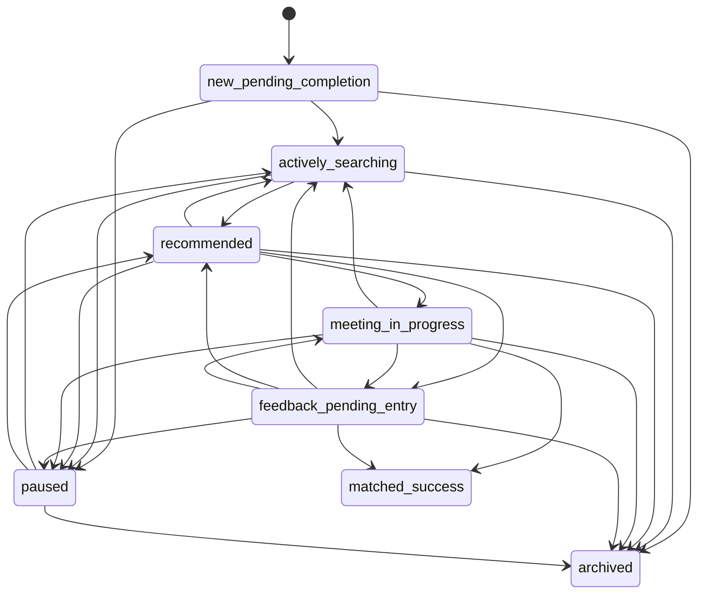

# 甄恋 CRM 状态模型冻结 v1

> 状态：`v1` 冻结，可引用  
> 适用范围：甄恋 CRM 当前主线第一阶段，生命周期状态模型冻结  
> 上游文档：
> - [plan-zhenlian-phase-1.md](/Users/myandong/Projects/marry2/docs/current/zhenlian/plan-zhenlian-phase-1.md)
> - [freeze-zhenlian-fields-v1.md](/Users/myandong/Projects/marry2/docs/current/zhenlian/freeze-zhenlian-fields-v1.md)
> - [freeze-zhenlian-data-model-v1.md](/Users/myandong/Projects/marry2/docs/current/zhenlian/freeze-zhenlian-data-model-v1.md)
> - [todo-zhenlian-phase-1.md](/Users/myandong/Projects/marry2/docs/current/zhenlian/todo-zhenlian-phase-1.md)
> 说明：本文回答“`status` 到底有哪些正式状态、能怎么迁移、`next_action / owner / due_at / blocking_reason` 怎么定义、提醒和日志怎么收口”，是第一阶段状态系统的正式合同。

---

## 一、冻结结论

第一阶段状态模型 `v1` 一次性定死了 6 件事：

1. `status` 保留现有字段名，但正式语义升级为 8 态生命周期模型
2. `status` 仍然属于 `P0` 主显字段，但对象归属固定在 `customer_lifecycle`
3. `next_action`、`owner`、`due_at`、`blocking_reason` 成为生命周期对象一等字段，不再散落在备注
4. 旧 `ProfileStatus` 四态到新 8 态的映射规则已经固定
5. 提醒规则、迁移矩阵、日志字段已经形成正式规范
6. 当前代码仍停留在老四态，但从本文件起，规划、schema 草案、AI 提取目标结构、页面实现准备都必须以新状态合同为准

---

## 二、模型原则

### 2.1 客户状态不等于资料完整度，也不等于单条匹配记录状态

- `status` 表示“这个客户当前最主要的推进阶段”
- 资料是否完整由字段补齐度判断，不直接等于生命周期状态
- 单条 `match.status` 表示某一条推介或配对线程的进展，不等于客户总状态
- 生命周期状态是客户层聚合视图；匹配状态是候选线程层细分视图

### 2.2 一个客户同一时刻只能有一个主状态

允许一个客户同时存在多条推介线程，但只允许一个当前主状态。

当多条线程并存时，生命周期主状态按推进强度聚合：

1. `matched_success`
2. `meeting_in_progress`
3. `feedback_pending_entry`
4. `recommended`
5. `actively_searching`
6. `new_pending_completion`

特殊说明：

- `paused` 和 `archived` 是人工覆盖状态，优先级高于普通推进态
- 一旦人工置为 `paused` 或 `archived`，系统不再自动用匹配线程把它改回开放状态

### 2.3 生命周期状态分三类

| 类别 | 状态 | 含义 |
|------|------|------|
| `open` | `new_pending_completion` `actively_searching` `recommended` `meeting_in_progress` `feedback_pending_entry` | 正在推进中的开放状态 |
| `suspended` | `paused` | 暂停推进，但仍保留后续复活可能 |
| `closed` | `matched_success` `archived` | 已收口，不再继续常规推进 |

### 2.4 `due_at` 是经营动作截止时间，不等于任何业务对象的自然时间

- `due_at` 表示“当前 `next_action` 最晚应处理到什么时候”
- 它不是客户生日、认证到期日，也不是永久通用的提醒时间
- 如果客户有约见安排，约见真实发生时间应落在后续约见对象或匹配对象；第一阶段允许先把“约见前提醒动作”的操作时间写入 `due_at`

### 2.5 当前代码兼容原则

当前仓库里的客户状态仍是老四态：

- [types/database.ts](/Users/myandong/Projects/marry2/types/database.ts)
- [app/(matchmaker)/matchmaker/clients/page.tsx](/Users/myandong/Projects/marry2/app/(matchmaker)/matchmaker/clients/page.tsx)
- [app/(admin)/admin/clients/page.tsx](/Users/myandong/Projects/marry2/app/(admin)/admin/clients/page.tsx)

本文件定义的是第一阶段目标合同：

- 文档、schema 草案、导入规则、AI 结构化目标先按新 8 态设计
- 物理枚举迁移和界面切换可以在实现阶段单独落地
- 迁移前如果仍使用老四态，必须遵守本文的兼容映射规则

---

## 三、正式状态集合 v1

### 3.1 状态总览

### 3.2 状态定义表

| key | 中文名 | 类别 | 状态含义 | 进入条件 | 退出条件 | 是否主显 | 典型系统动作 |
|------|------|------|------|------|------|------|------|
| `new_pending_completion` | 新建待完善 | `open` | 已建档，但还不具备稳定进入匹配/推介的最小条件 | 新建客户；或导入后只形成草稿；或 `P0/P1` 关键字段缺失 | 核心资料补齐后进入 `actively_searching`；也可人工 `paused` 或 `archived` | `是` | 生成缺失字段补齐任务 |
| `actively_searching` | 积极寻找中 | `open` | 客户基本资料和意图已可用，处于正常匹配、筛选、沟通推进阶段 | 基础资料可用于筛选；没有更强推进态占用主状态 | 发出推介进入 `recommended`；暂停进入 `paused`；明确退档进入 `archived` | `是` | 久未推进提醒、候选人筛选任务 |
| `recommended` | 已推介 | `open` | 已向客户推送候选人或已进入候选沟通，等待客户/候选人的结构化反馈 | 至少存在一条仍在推进的推介线程，且当前主任务是等待反馈或继续沟通 | 安排约见进入 `meeting_in_progress`；需要补录反馈进入 `feedback_pending_entry`；一轮结束但继续找人回到 `actively_searching` | `是` | 推介后未回复提醒 |
| `meeting_in_progress` | 约见中 | `open` | 已经进入见面安排、见面前确认、见面进行中或见面后短期观察阶段 | 推介线程进入“双方同意 / 已排约 / 正在见面”的阶段 | 见面后待补反馈进入 `feedback_pending_entry`；成功进入 `matched_success`；失败后回 `actively_searching` | `是` | 约见前提醒、见面跟进任务 |
| `feedback_pending_entry` | 反馈待录入 | `open` | 外部反馈已经出现或应当出现，但系统里还没有结构化录入结果 | 推介后电话反馈、见面后反馈、关键沟通反馈尚未完成录入 | 录入反馈后根据结果进入 `actively_searching / recommended / meeting_in_progress / matched_success / archived` | `是` | 反馈补录提醒 |
| `paused` | 暂缓 | `suspended` | 仍保留客户，但当前明确不推进，等待未来复活 | 客户主动暂停、条件未谈妥、时机不合适、内部暂时无法推进 | 到达复活时间或阻塞消除后回 `actively_searching`；如仍存在未结束推介，可回 `recommended`；彻底关闭则进 `archived` | `是` | 暂缓复活提醒 |
| `matched_success` | 已成功匹配 | `closed` | 当前阶段的业务目标已经达成，应退出常规推进 | 双方确认匹配成功、稳定交往或业务定义的成功条件成立，并经人工确认 | 默认不退出；若需重开，只允许人工例外回到 `actively_searching` | `是` | 关闭开放任务和提醒 |
| `archived` | 退档 | `closed` | 明确不再继续服务或当前档案失效 | 客户撤回、无法联系、资格不符、长期无效、人工判定退档 | 默认不退出；若重新激活，只允许人工例外回到 `new_pending_completion` 或 `actively_searching` | `是` | 关闭开放任务和提醒 |

### 3.3 状态级经营要求

| 状态 | `owner` | `next_action` | `due_at` | `blocking_reason` |
|------|------|------|------|------|
| `new_pending_completion` | 必填 | 必填 | 必填 | 默认空 |
| `actively_searching` | 必填 | 必填 | 必填 | 默认空 |
| `recommended` | 必填 | 必填 | 必填 | 默认空 |
| `meeting_in_progress` | 必填 | 必填 | 必填 | 默认空 |
| `feedback_pending_entry` | 必填 | 必填 | 必填 | 默认空 |
| `paused` | 必填 | 必填 | 必填，表示下次复活/复看时间 | 必填 |
| `matched_success` | 保留最后负责人 | 置空 | 置空 | 置空 |
| `archived` | 保留最后负责人 | 置空 | 置空 | 置空 |

### 3.4 `feedback_pending_entry` 的特殊约束

- 这是短停留状态，不是长期存放状态
- 第一阶段默认要求 `72` 小时内完成录入或迁移到下一状态
- 如果反馈迟迟没有被录入，不应继续伪装成 `recommended` 或 `meeting_in_progress`

---

## 四、旧状态到新状态的兼容映射

### 4.1 老 `ProfileStatus` 四态到新 8 态的主映射

| 旧值 | 新值 | 说明 |
|------|------|------|
| `active` | 默认映射到 `actively_searching` | 但如果存在更强推进信号，应继续细分到 `recommended / meeting_in_progress / feedback_pending_entry` |
| `paused` | `paused` | 保留原语义，但必须补齐 `blocking_reason` 和复活时间 |
| `matched` | `matched_success` | 视为已收口成功状态 |
| `inactive` | 默认映射到 `archived` | 但如实际只是未补齐资料或暂缓，应按下方优先级规则落到 `new_pending_completion` 或 `paused` |

### 4.2 迁移优先级规则

当老数据迁移时，同时看旧 `profiles.status` 与周边事实，优先级按下面顺序判断：

| 优先级 | 条件 | 目标状态 |
|------|------|------|
| `1` | 旧状态为 `matched`，或存在成功配对事实 | `matched_success` |
| `2` | 人工明确标记暂停、存在明确复活时间或暂停原因 | `paused` |
| `3` | 存在活动中的 `match.status = both_agreed / meeting_scheduled` | `meeting_in_progress` |
| `4` | 存在活动中的 `match.status = met` 且反馈未结构化 | `feedback_pending_entry` |
| `5` | 存在活动中的 `match.status = pending / reviewing / contacted_male / contacted_female` | `recommended` |
| `6` | 关键建档字段未补齐，且尚未进入正常推介 | `new_pending_completion` |
| `7` | 旧状态为 `active` | `actively_searching` |
| `8` | 旧状态为 `inactive` 且无其他可恢复信号 | `archived` |

### 4.3 现有配对状态到生命周期状态的辅助映射

| `match.status` | 生命周期状态建议 | 说明 |
|------|------|------|
| `pending` | `recommended` | 已进入候选推介但未完成确认 |
| `reviewing` | `recommended` | 红娘/客户仍在看候选 |
| `contacted_male` | `recommended` | 已触达一侧，等待反馈 |
| `contacted_female` | `recommended` | 已触达一侧，等待反馈 |
| `both_agreed` | `meeting_in_progress` | 已具备约见推进前提 |
| `meeting_scheduled` | `meeting_in_progress` | 已排约见 |
| `met` | `feedback_pending_entry` | 见面事实已发生，但需要尽快录入反馈 |
| `succeeded` | `matched_success` | 配对层已成功，可推动客户层成功收口 |
| `failed` | 不直接决定 | 应结合客户是否继续寻找，通常回 `actively_searching` |
| `dismissed` | 不直接决定 | 单条候选关闭不等于客户退档 |

### 4.4 旧 `active` 的特殊拆分规则

旧系统里很多 `active` 其实混了 4 种语义：

1. 资料还没补完，但档已经建了
2. 正常寻找中
3. 已经推介但没把状态改细
4. 已经见过面但没有补反馈

所以第一阶段禁止继续把 `active` 当万能状态。迁移和后续实现都必须按以下规则拆：

- 缺资料，进 `new_pending_completion`
- 在找人，进 `actively_searching`
- 已推介，进 `recommended`
- 见面后待补录，进 `feedback_pending_entry`

---

## 五、状态迁移矩阵 v1

### 5.1 允许的标准迁移

| 从状态 | 到状态 | 是否允许 | 条件 | 是否必须人工确认 |
|------|------|------|------|------|
| `new_pending_completion` | `actively_searching` | `允许` | `P0` 和建档骨架可用，允许进入正常寻找 | `否` |
| `new_pending_completion` | `paused` | `允许` | 明确暂缓原因与复活时间 | `是` |
| `new_pending_completion` | `archived` | `允许` | 明确不再推进或数据无效 | `是` |
| `actively_searching` | `recommended` | `允许` | 至少一条推介线程进入活动态 | `否` |
| `actively_searching` | `paused` | `允许` | 明确暂缓原因与复活时间 | `是` |
| `actively_searching` | `archived` | `允许` | 明确退档或关闭原因 | `是` |
| `recommended` | `meeting_in_progress` | `允许` | 推介进入双方同意/排期 | `否` |
| `recommended` | `feedback_pending_entry` | `允许` | 外部反馈已出现但未结构化录入 | `否` |
| `recommended` | `actively_searching` | `允许` | 本轮推介结束但客户继续寻找 | `否` |
| `recommended` | `paused` | `允许` | 明确暂停，不再推进当前轮次 | `是` |
| `recommended` | `archived` | `允许` | 明确退档 | `是` |
| `meeting_in_progress` | `feedback_pending_entry` | `允许` | 见面或关键沟通已发生，需要补录反馈 | `否` |
| `meeting_in_progress` | `actively_searching` | `允许` | 见面后确认不成，但客户继续寻找 | `否` |
| `meeting_in_progress` | `paused` | `允许` | 双方或一方暂缓，需保留未来复活可能 | `是` |
| `meeting_in_progress` | `matched_success` | `允许` | 成功条件达成 | `是` |
| `meeting_in_progress` | `archived` | `允许` | 终止服务或档案无效 | `是` |
| `feedback_pending_entry` | `actively_searching` | `允许` | 反馈已录入，结论为继续找人 | `否` |
| `feedback_pending_entry` | `recommended` | `允许` | 反馈已录入，仍有活动推介要继续跟 | `否` |
| `feedback_pending_entry` | `meeting_in_progress` | `允许` | 反馈已录入，继续进入见面/复见阶段 | `否` |
| `feedback_pending_entry` | `paused` | `允许` | 明确暂缓原因与复活时间 | `是` |
| `feedback_pending_entry` | `matched_success` | `允许` | 反馈已确认成功 | `是` |
| `feedback_pending_entry` | `archived` | `允许` | 明确退档 | `是` |
| `paused` | `actively_searching` | `允许` | 阻塞已解除，恢复正常寻找 | `是` |
| `paused` | `recommended` | `允许` | 暂缓期间保留的推介线程重新恢复 | `是` |
| `paused` | `archived` | `允许` | 明确不再恢复 | `是` |

### 5.2 例外迁移

| 从状态 | 到状态 | 是否允许 | 额外要求 |
|------|------|------|------|
| `actively_searching` | `matched_success` | `例外允许` | 需人工确认并写明“系统外已成功”原因 |
| `recommended` | `matched_success` | `例外允许` | 需人工确认并写明为什么未经过约见状态 |
| `matched_success` | `actively_searching` | `例外允许` | 只允许负责人或管理员重开，并记录重开原因 |
| `archived` | `new_pending_completion` | `例外允许` | 重新建档或旧档重启，需记录来源与原因 |
| `archived` | `actively_searching` | `例外允许` | 客户重新激活且资料已可用，需人工确认 |

### 5.3 明确禁止的迁移

| 从状态 | 到状态 | 禁止原因 |
|------|------|------|
| `new_pending_completion` | `meeting_in_progress` | 跳过基础建档和推介阶段，语义失真 |
| `new_pending_completion` | `feedback_pending_entry` | 尚未形成可被反馈的正式推进阶段 |
| `paused` | `matched_success` | 暂停状态必须先恢复推进，再收口成功 |
| `archived` | `recommended` | 退档后不能直接假装还在活动推介中 |
| `archived` | `meeting_in_progress` | 退档后不能直接进入高推进态 |

---

## 六、`next_action` 标准动作集 v1

### 6.1 正式动作表

| key | 中文名 | 适用状态 | 含义 | `due_at` 是否必填 | 完成后典型去向 |
|------|------|------|------|------|------|
| `complete_profile` | 补齐建档信息 | `new_pending_completion` | 补完建档骨架和关键字段 | `是` | 留在原状态或进 `actively_searching` |
| `verify_contactability` | 确认可联系性 | `new_pending_completion` `actively_searching` | 核实电话/微信/可达性 | `是` | 留在原状态 |
| `confirm_preferences` | 确认择偶要求 | `new_pending_completion` `actively_searching` | 把意图与硬边界问清 | `是` | 留在原状态或进 `actively_searching` |
| `shortlist_candidates` | 筛候选人 | `actively_searching` | 内部完成筛选、缩小候选范围 | `是` | 留在 `actively_searching` |
| `send_recommendation` | 发起推介 | `actively_searching` | 正式发出推荐或进入候选沟通 | `是` | 进 `recommended` |
| `await_client_response` | 等待客户反馈 | `recommended` | 等待客户或候选人回复 | `是` | 留在 `recommended` 或进 `feedback_pending_entry` |
| `schedule_meeting` | 安排约见 | `recommended` `meeting_in_progress` | 协调双方时间和见面方式 | `是` | 进或留在 `meeting_in_progress` |
| `remind_before_meeting` | 约见前提醒 | `meeting_in_progress` | 约见前向双方或红娘做提醒 | `是` | 留在 `meeting_in_progress` |
| `collect_feedback` | 收集并录入反馈 | `meeting_in_progress` `feedback_pending_entry` | 把电话、微信、见面反馈转成结构化结果 | `是` | 进任一后续状态 |
| `resolve_blocker` | 解决阻塞点 | `paused` | 处理导致暂缓的核心问题 | `是` | 留在 `paused` 或进 `actively_searching` |
| `reactivate_client` | 复活客户 | `paused` | 到期复联、恢复正常推进 | `是` | 进 `actively_searching` 或 `recommended` |

### 6.2 状态默认动作建议

| 状态 | 默认 `next_action` 候选 |
|------|------|
| `new_pending_completion` | `complete_profile` / `verify_contactability` / `confirm_preferences` |
| `actively_searching` | `shortlist_candidates` / `send_recommendation` |
| `recommended` | `await_client_response` / `schedule_meeting` |
| `meeting_in_progress` | `schedule_meeting` / `remind_before_meeting` / `collect_feedback` |
| `feedback_pending_entry` | `collect_feedback` |
| `paused` | `resolve_blocker` / `reactivate_client` |
| `matched_success` | `null` |
| `archived` | `null` |

### 6.3 使用约束

- 一个客户同一时刻只允许一个主 `next_action`
- `next_action` 必须可执行，不能写成空泛备注
- `matched_success` 和 `archived` 必须把 `next_action` 清空
- 如果只是补一条备注，不应滥用为 `next_action`

---

## 七、生命周期主字段语义

### 7.1 `owner`

| 规则 | 正式口径 |
|------|------|
| 含义 | 当前对客户推进结果负责的主红娘 |
| 数据形态 | 单值 `user_id`，不做多人数组 |
| 必填范围 | 所有 `open` 和 `paused` 状态 |
| 变更规则 | 换负责人必须记日志 |
| 不等于 | `created_by`、最近编辑人、管理员审批人 |

### 7.2 `due_at`

| 规则 | 正式口径 |
|------|------|
| 含义 | 当前 `next_action` 的经营截止时间 |
| 必填范围 | 所有 `open` 和 `paused` 状态 |
| `paused` 下含义 | 下次复活、复看或复联时间 |
| 关闭状态 | `matched_success / archived` 必须清空 |
| 不等于 | 客户生日、认证时间、长期自然时间属性 |

### 7.3 `blocking_reason`

`blocking_reason` 是一级阻塞码，不是自由备注区。

正式枚举建议固定为：

| 值 | 中文含义 |
|------|------|
| `waiting_client` | 等客户回复 |
| `material_incomplete` | 资料未补齐 |
| `scheduling_conflict` | 时间排期冲突 |
| `family_objection` | 家庭意见阻塞 |
| `financial_expectation_gap` | 经济预期差距 |
| `distance_constraint` | 地域或距离阻塞 |
| `health_or_fertility_issue` | 健康或生育相关阻塞 |
| `internal_capacity` | 内部资源或排期不足 |
| `not_reachable` | 暂时联系不上 |
| `other` | 其他 |

使用约束：

- `paused` 状态下必填
- 其他开放状态默认留空，除非确有明确阻塞
- 详细解释不写进主字段，而是写进状态变更日志的 `reason_notes`
- 离开 `paused` 后默认清空

---

## 八、提醒规则 v1

### 8.1 正式提醒场景

| 场景 | 触发条件 | 目标状态 | 接收人 | 关闭条件 |
|------|------|------|------|------|
| 久未推进提醒 | `due_at` 已超时，或 `last_progressed_at` 超过状态阈值 | `new_pending_completion` `actively_searching` `recommended` `feedback_pending_entry` | `owner` | 更新 `next_action`、改状态或刷新 `due_at` |
| 推介后未回复提醒 | `status = recommended` 且 `next_action = await_client_response`，超过截止时间仍无结构化反馈 | `recommended` | `owner` | 录入反馈、改状态或更新截止时间 |
| 约见前提醒 | `status = meeting_in_progress` 且 `next_action = remind_before_meeting`，到达提醒时间 | `meeting_in_progress` | `owner` | 完成提醒或切换下一动作 |
| 见面后反馈提醒 | 见面已发生但未录反馈，或 `status = feedback_pending_entry` 超过截止时间 | `meeting_in_progress` `feedback_pending_entry` | `owner` | 录入反馈并迁移状态 |
| 暂缓复活提醒 | `status = paused` 且达到 `due_at` | `paused` | `owner` | 完成复联并改变状态，或延后复活时间 |

### 8.2 第一阶段默认阈值

| 状态/场景 | 默认阈值 |
|------|------|
| `new_pending_completion` | 建档后 `24` 小时仍未补齐骨架 |
| `actively_searching` | `7` 天无推进 |
| `recommended` | 推介后 `48` 小时无回复 |
| `feedback_pending_entry` | `24` 小时未录反馈 |
| `paused` | 到达 `due_at` 当天触发复活提醒 |

### 8.3 提醒优先级

| 优先级 | 场景 |
|------|------|
| `high` | 见面后反馈未录、推介后超时未回复 |
| `medium` | 约见前提醒、暂缓到期复活 |
| `low` | 正常久未推进 |

---

## 九、状态变更日志合同 v1

### 9.1 正式日志字段

| 字段 | 必填 | 含义 |
|------|------|------|
| `customer_id` | `是` | 哪个客户发生了变化 |
| `from_status` | `是` | 变更前状态 |
| `to_status` | `是` | 变更后状态 |
| `actor_user_id` | `是` | 谁改的 |
| `actor_role` | `是` | 红娘 / 管理员 / 系统 |
| `action_key` | `否` | 本次状态变化对应的 `next_action` 或触发动作 |
| `reason_code` | `是` | 为什么改，建议标准化一级原因 |
| `reason_notes` | `否` | 自由文本补充说明 |
| `changed_at` | `是` | 何时改的 |
| `owner_before` | `否` | 变更前负责人 |
| `owner_after` | `否` | 变更后负责人 |
| `due_at_before` | `否` | 变更前截止时间 |
| `due_at_after` | `否` | 变更后截止时间 |
| `blocking_reason_before` | `否` | 变更前阻塞码 |
| `blocking_reason_after` | `否` | 变更后阻塞码 |
| `source_match_id` | `否` | 如果由某条配对推进触发，可挂来源 match |

### 9.2 日志规则

- 每次 `status` 变化都必须生成一条日志
- 任何 `matched_success`、`archived`、`paused` 的进入动作，都必须填写 `reason_code`
- `matched_success` 和 `archived` 的日志不能只有状态，没有原因
- 如果只改了 `owner / due_at / blocking_reason`，第一阶段建议也记生命周期更新日志，但最低要求是状态变化必须有完整日志

---

## 十、冻结评审结论 v1

### 10.1 本轮已冻结完成

- 第一阶段 8 态生命周期状态集合
- 老四态到新 8 态的兼容映射
- 状态迁移矩阵
- `next_action` 标准动作集
- `owner / due_at / blocking_reason` 字段语义
- 提醒规则
- 状态变更日志字段

### 10.2 本轮明确不展开

- 多负责人协作分配
- 多门店或分销链路下的归属切换
- 自动化成功判定算法
- 复杂 SLA 升级策略

### 10.3 本轮结论

状态模型冻结已达到第一阶段可引用状态。

从现在开始：

1. [freeze-zhenlian-fields-v1.md](/Users/myandong/Projects/marry2/docs/current/zhenlian/freeze-zhenlian-fields-v1.md) 负责字段合同
2. [freeze-zhenlian-data-model-v1.md](/Users/myandong/Projects/marry2/docs/current/zhenlian/freeze-zhenlian-data-model-v1.md) 负责对象边界
3. 本文负责生命周期状态合同

下一步应进入：

1. 导入、资料与资料卡边界对齐
2. schema 草案推导
3. 页面实现前 gate 检查
